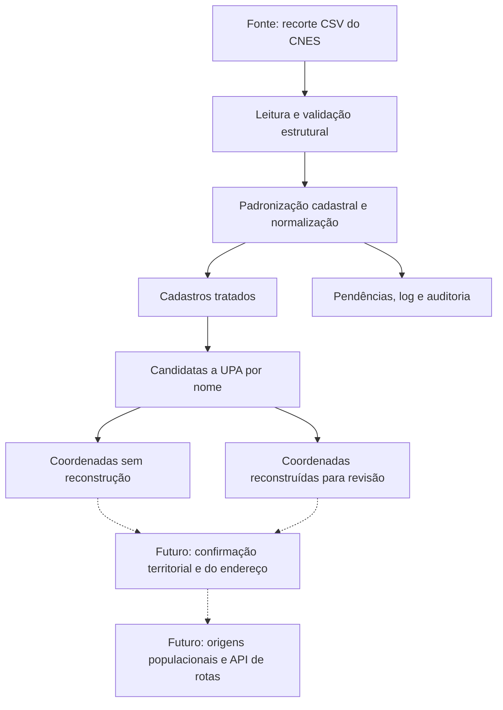

# Atividade 02 — Implementação do pipeline inicial de dados

**Projeto:** acessibilidade geográfica potencial às UPAs de Salvador.

**Escopo desta versão:** preparar a base cadastral, avaliar sua qualidade e gerar coordenadas candidatas que poderão alimentar a etapa de localização e cálculo de deslocamento após validação.

## 1. Definição da entrada

A entrada é o arquivo `upa_bahia_202607.csv`, utilizado como recorte do CNES na Atividade 01. A competência julho de 2026 é indicada pelo nome do arquivo.

O processamento foi realizado sobre o arquivo recebido. A consulta original e os filtros utilizados para produzir esse recorte ainda precisam ser documentados para permitir a reprodução da etapa de aquisição.

O arquivo possui 37.961 bytes, 98 registros e 56 colunas. Seu formato é CSV, delimitado por ponto e vírgula, lido com UTF-8-SIG.

Todos os campos são inicialmente lidos como texto para preservar códigos, zeros iniciais e representações originais. O hash SHA-256 da entrada é registrado em `dados/processados/execucao.json`.

Os campos relevantes incluem:

- `CO_CNES` e `CO_UNIDADE`;
- `NO_FANTASIA`;
- endereço e CEP;
- `CO_MUNICIPIO_GESTOR`;
- `TP_UNIDADE`, `CO_TIPO_UNIDADE` e `CO_TIPO_ESTABELECIMENTO`;
- `NU_LATITUDE` e `NU_LONGITUDE`.

O nome do arquivo não garante que todos os registros sejam UPAs. A entrada contém, por exemplo, `MOTOLANCIA MT 06 A` e diferentes valores de `TP_UNIDADE`.

## 2. Definição da transformação

O pipeline realiza leitura textual, validação do esquema, remoção de espaços nas extremidades, seleção de campos relevantes, validação de identificadores, normalização de coordenadas, triagem de candidatas a UPA e geração de saídas estruturadas.

### Identificadores

`CO_CNES` foi adotado como chave porque seus valores possuem sete dígitos e são distintos nesta entrada.

`CO_UNIDADE` foi preservado para auditoria. Seus valores estão reduzidos a duas representações em notação científica:

- `2,92741E+12`: 63 registros;
- `2,9274E+12`: 35 registros.

Esses valores não distinguem adequadamente os estabelecimentos. Expandir a notação científica não recuperaria com segurança os identificadores originais.

### Latitude e longitude

`NU_LATITUDE` e `NU_LONGITUDE` são os campos destinados à localização geográfica dos estabelecimentos. Após confirmação, poderão fornecer as coordenadas de destino utilizadas nas consultas de deslocamento à API do Google Maps.

No arquivo recebido, esses campos apresentam valores com múltiplos pontos, como:

- latitude: `-12.959.299.708.001.400`;
- longitude: `-3.848.756.432.533.260`.

Foi implementada a função `normalizar_coordenada`, que:

1. Identifica valores ausentes.
2. Preserva coordenadas em formato decimal simples que estejam dentro da faixa adotada.
3. Converte vírgula decimal para ponto quando o formato é reconhecido.
4. Identifica valores com vários grupos de dígitos separados por pontos.
5. Remove esses separadores e testa possíveis posições da casa decimal.
6. Retorna uma coordenada candidata somente quando existe uma única interpretação dentro da faixa adotada.
7. Sinaliza casos ambíguos, não reconhecidos ou fora da faixa.

As faixas de triagem utilizadas são:

| Coordenada | Mínimo | Máximo |
|---|---:|---:|
| Latitude | -14 | -12 |
| Longitude | -39 | -37 |

Essas faixas representam uma região aproximada em torno de Salvador. Não correspondem ao limite municipal oficial e não devem ser aplicadas à base nacional ou a toda a Bahia.

Para o exemplo apresentado, a transformação produz:

| Campo | Valor candidato |
|---|---:|
| Latitude | -12.9592997080014 |
| Longitude | -38.4875643253326 |

A transformação pressupõe que os dígitos foram preservados e que houve alteração dos separadores. Essa hipótese ainda precisa ser conferida com uma fonte independente ou com a localização conhecida da unidade.

Os valores recebidos permanecem em `latitude_original` e `longitude_original`. Os resultados numéricos são armazenados em `latitude` e `longitude`.

O status distingue:

- `VALIDAS_NUMERICAMENTE`: par em formato decimal aceito, dentro das faixas, sem reconstrução;
- `RECONSTRUIDAS_REVISAR`: par completo com pelo menos uma coordenada reconstruída;
- `PENDENTES`: não foi possível obter um par completo.

A validade numérica e a reconstrução não comprovam a correspondência com o endereço da unidade.

### Triagem de UPAs

O nome é usado como critério preliminar: a expressão `UPA` como palavra inteira ou `UNIDADE DE PRONTO ATENDIMENTO` gera a marca de candidata.

Essa regra não substitui confirmação cadastral oficial e pode omitir unidades com outras denominações.

## 3. Implementação

O script `pipeline.py` utiliza apenas a biblioteca padrão do Python e permite parametrizar a entrada, a saída e a codificação.

As principais funções são:

- `normalizar_coordenada`: interpreta valores e gera candidatos quando possível;
- `escrever_csv`: padroniza os arquivos de saída;
- `executar`: coordena leitura, transformação, validação e auditoria;
- `teste_normalizacao`: verifica exemplos de reconstrução, preservação e ausência.

Falhas estruturais interrompem a execução. Problemas de conteúdo geram alertas por registro e arquivos de pendências.

Se houver duplicidades em `CO_CNES`, todas as ocorrências envolvidas ficam fora da base cadastral válida e são preservadas para revisão.

Um cadastro é considerado válido nesta versão quando possui CNES com sete dígitos, único, e nome preenchido. Isso não equivale à confirmação oficial do estabelecimento.

Comandos de execução:

```bash
python pipeline.py --teste
python pipeline.py
```

Caso o CSV esteja na mesma pasta do script:

```bash
python pipeline.py --entrada upa_bahia_202607.csv
```

## 4. Validações implementadas

| Verificação | Regra e ação | Resultado observado |
|---|---|---|
| Esquema e estrutura | Colunas obrigatórias presentes, sem cabeçalhos duplicados ou linhas desalinhadas | Aprovado |
| Identificador CNES | Exatamente sete dígitos, preservados como texto | 98 válidos |
| Unicidade CNES | Duplicidades são encaminhadas para revisão | Nenhuma duplicidade |
| Nome | Preenchimento obrigatório para saída cadastral | 98 preenchidos |
| CO_UNIDADE | Representações diferentes de inteiro textual geram alerta | 98 alertas |
| CEP | Exatamente oito dígitos | 98 aprovados no formato |
| Município gestor | Exatamente seis dígitos | 98 aprovados no formato |
| CO_TIPO_UNIDADE | Verificação de preenchimento | 98 ausentes |
| Coordenadas originais | Verificação do formato decimal | 98 pares com formato inadequado |
| Reconstrução regional | Uma única interpretação dentro das faixas adotadas | 98 pares candidatos para revisão |

`CO_TIPO_UNIDADE`, `TP_UNIDADE` e `CO_TIPO_ESTABELECIMENTO` são preservados como campos distintos.

As validações não confirmam cobertura SUS, classificação oficial como UPA, funcionamento atual ou localização no endereço informado.

## 5. Evidência de execução

A transformação integrada foi verificada em 11/09/2026 sobre a entrada real de 98 registros.

| Indicador | Quantidade |
|---|---:|
| Registros recebidos | 98 |
| Cadastros produzidos | 98 |
| Registros com pelo menos um alerta | 98 |
| Registros com impedimento cadastral por CNES/nome | 0 |
| Valores individuais de coordenadas reconstruídos | 196 |
| Pares de coordenadas reconstruídos para revisão | 98 |
| Candidatas a UPA identificadas pelo nome | 12 |
| Candidatas a UPA com coordenadas reconstruídas | 12 |
| Candidatas com coordenadas válidas sem reconstrução | 0 |
| Exclusões silenciosas | 0 |

Foram produzidas cinco saídas CSV:

| Arquivo | Conteúdo | Registros |
|---|---|---:|
| `cadastros_tratados.csv` | Cadastros preservados, com coordenadas e status | 98 |
| `pendencias.csv` | Registros com alertas | 98 |
| `candidatas_upa_revisao.csv` | Candidatas identificadas pelo nome | 12 |
| `candidatas_coordenadas_validas.csv` | Candidatas com par válido sem reconstrução | 0 |
| `candidatas_coordenadas_reconstruidas.csv` | Candidatas com par reconstruído para revisão | 12 |

Também são gerados `execucao.json` e `execucao.log`, contendo contagens e informações da execução. O JSON registra hashes da entrada, do código e dos CSVs produzidos.

O arquivo de coordenadas válidas sem reconstrução permanece somente com o cabeçalho. As 12 candidatas com coordenadas reconstruídas são disponibilizadas no arquivo específico de revisão.

As saídas são subconjuntos sobrepostos e suas contagens não devem ser somadas.

Não houve necessidade de aparar espaços em cabeçalhos ou células. A transformação efetiva incluiu seleção e renomeação de campos, geração de coordenadas candidatas e classificação dos registros.

Foram contabilizados 392 alertas, distribuídos em 98 registros: representação inadequada de `CO_UNIDADE`, ausência de `CO_TIPO_UNIDADE`, latitude reconstruída e longitude reconstruída.

O teste simples verificou a reconstrução de um par conhecido pelo algoritmo, a preservação de um decimal válido e o tratamento de um valor ausente. O teste passou, mas não constitui validação da localização real da unidade.

## 6. Atualização da arquitetura

A arquitetura foi atualizada para incorporar a normalização e distinguir coordenadas aceitas diretamente de coordenadas reconstruídas.



| Camada | Implementado nesta atividade | Próxima etapa |
|---|---|---|
| Fonte de dados | Recorte CNES local e preservado | Documentar aquisição e integrar dados do IBGE |
| Pipeline | Validação cadastral, normalização, triagem e auditoria | Confirmar coordenadas, endereço e classificação |
| Representação | Cinco CSVs, JSON e log | Preparar origens e destinos para consultas |
| Análise e apresentação | Diagnóstico da qualidade dos dados | Indicadores e mapas de acessibilidade |

No código anterior, `base.py` selecionava colunas sem persistência e `rotas.py` desenhava um GeoJSON no Folium.

A versão atual estrutura a base e registra as transformações antes do cálculo de deslocamentos. A integração com o Google Maps permanece planejada e não foi executada nesta atividade.

## 7. Registro de decisão — até dez linhas

A implementação do pipeline revelou que a qualidade dos dados de localização é um dos principais riscos do projeto. Os campos de latitude e longitude apresentaram problemas de formatação, exigindo a reconstrução de valores candidatos. Embora o processamento tenha produzido coordenadas em formato decimal, ainda não há garantia de que elas correspondam à localização correta das unidades. Essa incerteza preocupa especialmente pela integração com a API do Google Maps, pois uma coordenada incorreta pode gerar uma rota aparentemente válida e comprometer a análise de acessibilidade. Assim, a próxima etapa será conferir os pontos com os endereços das unidades e realizar consultas de teste antes de ampliar a coleta.